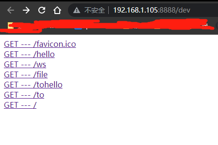

# Netty Showcase

使用Netty写的一些小demo

question: 好像发送了多个包
dev 有问题


## features

- [x] Http Server
- [x] Websocket Server
- [ ] 大文件发送 继续优化 
- [ ] todo... need your idea !

## 启动一个http 服务器

```java
final var router = Router.router()
        .GET("/", (req, resp) -> {
            resp.html("""
                    <meta charset="UTF-8">
                    <title>测试服务器</title> 
                    <h1>hello world</h1>
                      """
            );
        })
        .GET("/hello", (req, resp) -> resp.json("你好"))
        .faviconIco(faviconIco);

new HttpServ(8888, router).start();
```

## 启动一个websocket 服务器
```java
final var router = Router.router()
        .GET("/ws", (req, resp) -> {
             req.upgradeToWebSocket(ws -> {
                ws.textHooks(msg -> {
                    ws.send("hello world");
                });
            });
        })

new HttpServ(8888, router).start();
```

## Dev page
```java
  new HttpServ(8888, router)
        .name("我的http 服务器 !")
        .dev() /* open dev mode */
        .start();;
```
